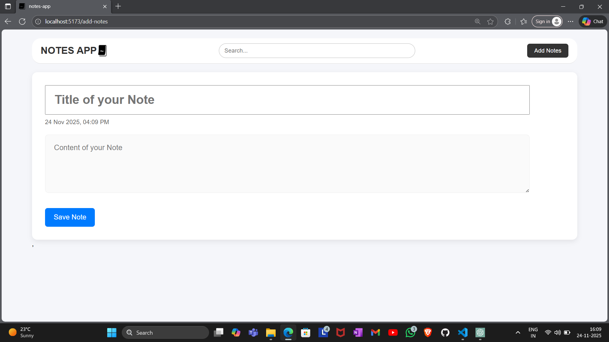
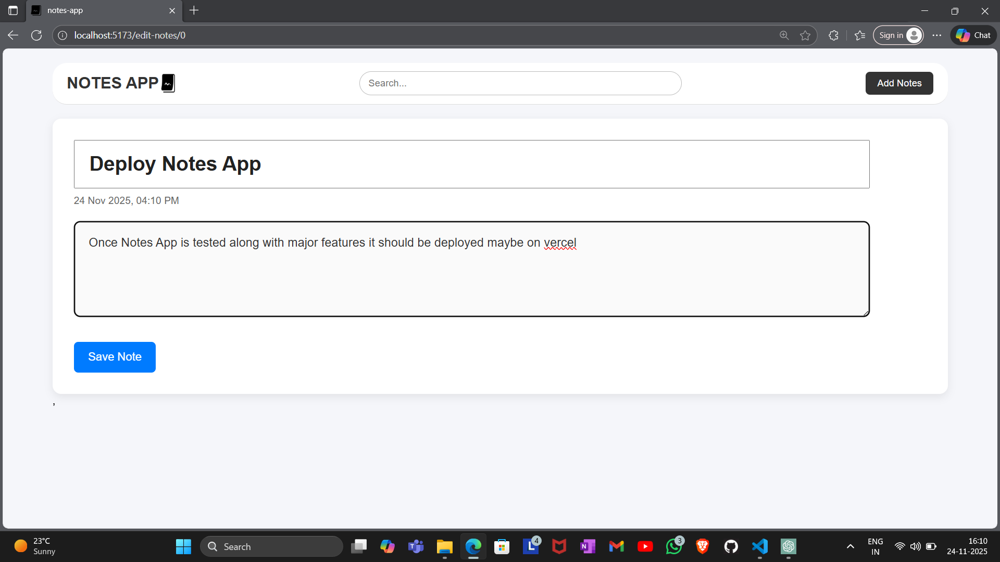
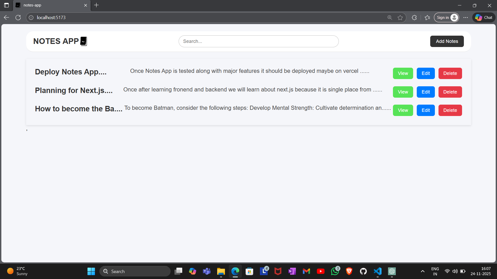
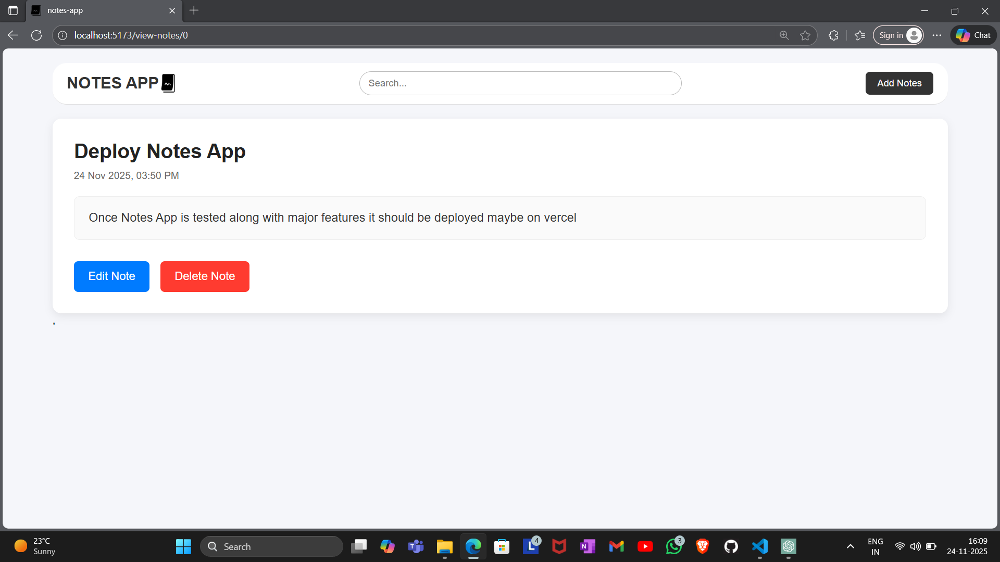

📝 Notes App

A fast, lightweight, and fully client-side React Notes App that allows users to create, edit, search, view, and delete notes — all stored securely in LocalStorage.
Designed with a clean UI and instant search functionality.

🚀 Features
✔ Create Notes

Add a new note with a title and content.
Each note is timestamped using dayjs.

✔ Edit Notes

Modify any existing note and save changes instantly.

✔ Delete Notes

Remove notes permanently with a single click.

✔ Live Search

Search through notes by title or content in real time.

✔ LocalStorage Sync

Notes are automatically saved in the browser using LocalStorage.
Even after a page refresh or browser restart, your notes stay intact.

✔ Individual Note View

Click any note to view it in a separate page.

✔ Clean Navigation

Includes a responsive navigation bar with integrated search.

📂 Project Structure
src/
│
├── Components/
│   └── Navbar.jsx
│
├── Pages/
│   ├── HomePage.jsx
│   ├── ViewNotePage.jsx
│   ├── AddNotePage.jsx
│   └── EditNotePage.jsx
│
├── App.jsx
├── index.css
└── main.jsx

🛠 Tech Stack

React

React Router

Day.js for timestamps

LocalStorage for persistence

CSS for styling

📦 Installation & Setup
1️⃣ Clone the repository
git clone https://github.com/princePandeyGitHub/notes-app.git

2️⃣ Install dependencies
npm install

3️⃣ Run the app
npm run dev

Open your browser and go to:

https://notes-app-tawny-six.vercel.app/

🖼 Screenshots

🧩 Future Improvements

🔖 Pin notes

🌙 Dark mode

🔄 Sync across devices

📌 Categories / tags

🧠 AI summaries 

🤝 Contributing

Contributions, issues, and feature requests are welcome!
Open a pull request or start a discussion anytime.

📜 License

This project is licensed under the MIT License — free to use, modify, and distribute.